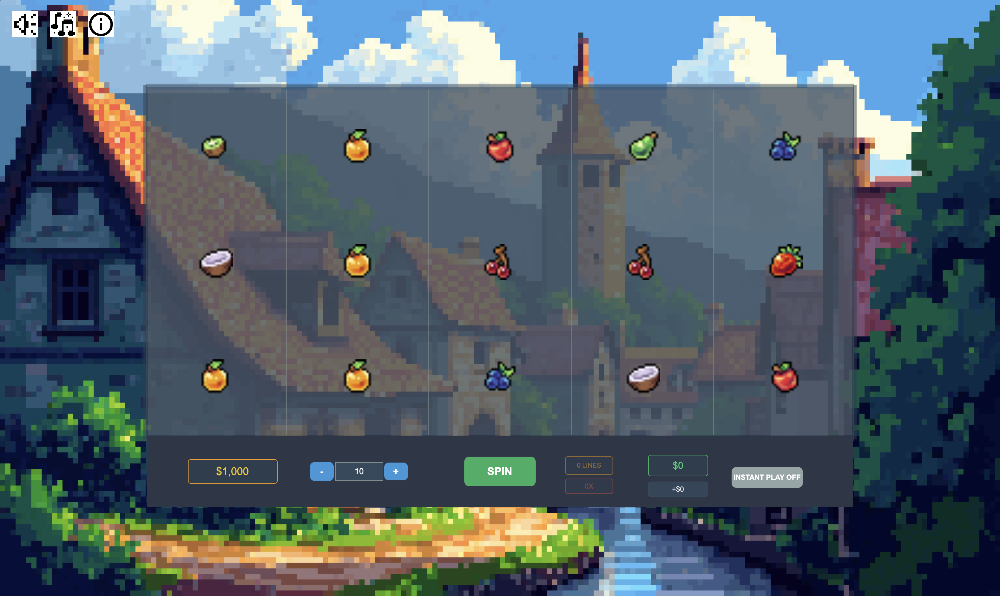

# Fruit Slot Game

A practice slot machine game featuring a 5-reel, 3-row grid with 20 paylines and colorful fruit symbols. Built with modern web technologies for learning game development concepts.



## Game Description

This is a classic fruit-themed slot machine where players:

- Spin 5 reels with various fruit symbols (Apple, Orange, Cherry, Strawberry, etc.)
- Match 3 or more identical symbols on any of the 20 paylines to win
- Enjoy smooth animations and sound effects
- View game rules and payouts through an info panel

## Technology Stack

- **PixiJS v8**: 2D graphics rendering and game engine
- **TypeScript**: Type-safe development with modern JavaScript
- **XState v5**: State management for game flow and logic
- **GSAP**: Smooth animations and transitions
- **Vite**: Fast development server and optimized builds

## Development

```bash
# Install dependencies
pnpm install

# Start development server
pnpm dev

# Build for production
pnpm build
```

## Key Features

- Responsive design that works on desktop and mobile
- Audio controls for music and sound effects
- Comprehensive info panel with rules and payline patterns
- Real-time win detection and payout calculations
- Smooth reel spinning animations
